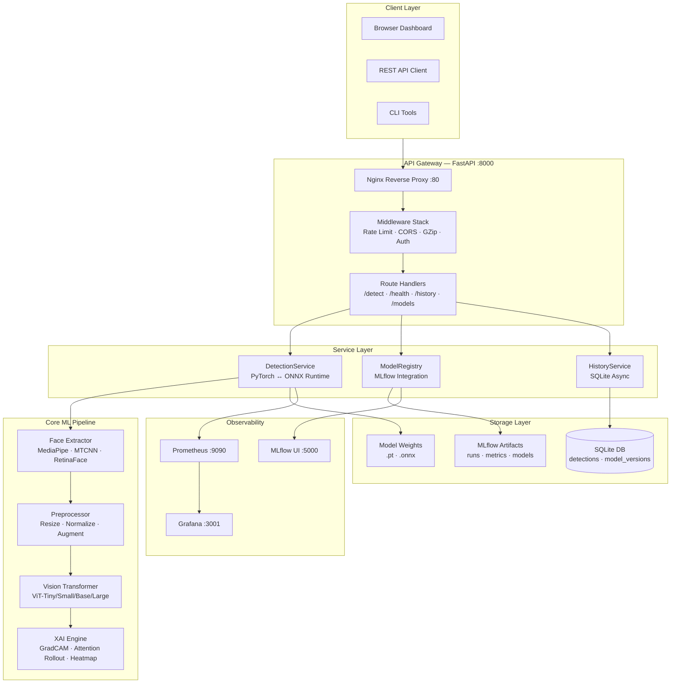

# DeepGuard — System Architecture

## Overview

DeepGuard is built using **Clean Architecture** principles with clear separation of concerns across four primary layers: API, Services, Core ML, and Storage.

---

## System Architecture Diagram



---

## Component Descriptions

### 1. Client Layer
| Component | Role |
|---|---|
| Browser Dashboard | HTML/CSS/JS SPA with dark mode, live charts, webcam scanner |
| REST API Client | Any HTTP client (curl, Postman, Python requests) |
| CLI Tools | `make` targets for training, export, benchmark, load-test |

### 2. API Gateway
**Nginx** acts as the outermost reverse proxy, handling SSL termination, static file serving (the frontend SPA), and proxying `/api/*` to the FastAPI backend.

**FastAPI Middleware Stack** (outer → inner):
1. `RequestLoggingMiddleware` — Attaches X-Request-ID, logs every request/response pair
2. `PrometheusMetricsMiddleware` — Records `http_requests_total`, `http_request_duration_seconds`
3. `RateLimitMiddleware` — Sliding-window IP rate limiting (60 req/min default)
4. `GZipMiddleware` — Compresses responses > 1KB
5. `TrustedHostMiddleware` — Validates `Host` headers
6. `CORSMiddleware` — Handles preflight and CORS headers

### 3. Service Layer

#### DetectionService (`services/detection/service.py`)
The central detection orchestrator:
- Loads the ViT model once at startup (cached in memory)
- Routes inference through **ONNX Runtime** (if `use_onnx=true`) or **PyTorch**
- Calls `FaceExtractor` → `ImagePreprocessor` → model forward pass → `ExplainabilityEngine`
- Persists results to SQLite via `DetectionRepository`

#### ModelRegistry (`services/model_registry/`)
- Wraps MLflow model registry API
- Handles model version registration, activation, metadata storage
- Provides endpoint data for `/api/v1/models`

#### HistoryService
- Async SQLite queries via `aiosqlite` + SQLAlchemy 2.0
- Pagination, filtering, aggregation for prediction history

### 4. Core ML Pipeline

```
Raw Image/Video Bytes
        ↓
Face Extraction (MediaPipe / MTCNN / RetinaFace)
        ↓
Preprocessing (Resize 224×224 · ImageNet Normalize)
        ↓
ViT Inference (Patch Embed → Transformer Blocks → Classification Head)
        ↓
Softmax → [P(real), P(fake)]
        ↓
Explainability (GradCAM · Attention Rollout · Heatmap Overlay)
        ↓
DetectionResult (label, confidence, xai_data, face_count, latency)
```

#### Vision Transformer Architecture
```
Input Image (224×224×3)
    ↓
Patch Embedding (16×16 patches → 196 tokens + [CLS] token)
    ↓
Position Embedding
    ↓
Transformer Encoder × N layers
    (LayerNorm → Multi-Head Self-Attention → Add & Norm → MLP → Add & Norm)
    ↓
[CLS] Token → Classification Head (Linear / MLP / AttentionPool)
    ↓
Logits (2) → Softmax → [P(real), P(fake)]
```

**Supported variants:**

| Variant | Params | Embed Dim | Depth | Heads |
|---|---|---|---|---|
| ViT-Tiny | ~6M | 192 | 12 | 3 |
| ViT-Small | ~22M | 384 | 12 | 6 |
| ViT-Base | ~86M | 768 | 12 | 12 |
| ViT-Large | ~307M | 1024 | 24 | 16 |

#### Explainable AI Engine (`utils/explainability.py`)
- **GradCAM**: Registers forward/backward hooks on the final transformer block. Computes gradient-weighted activation maps, resizes to face dimensions, normalizes to [0,1].
- **Attention Rollout**: Extracts self-attention weight tensors across all layers. Propagates attention recursively via matrix product with residual identity. Produces a 14×14 map resized to face size.
- **Heatmap Overlay**: Applies Jet colormap to attention/CAM map, blends 60% onto face crop with `cv2.addWeighted`.
- **ONNX Fallback**: Generates synthetic multi-Gaussian heatmaps centered on anatomical face landmarks when hooks cannot be applied.

### 5. Storage Layer

| Store | Technology | Usage |
|---|---|---|
| Relational DB | SQLite + SQLAlchemy 2.0 async | Detection results, model versions |
| Model Weights | Filesystem (`weights/`) | `.pt` (PyTorch), `.onnx` (ONNX Runtime) |
| MLflow Artifacts | SQLite + local filesystem | Run metrics, model artifacts, parameters |

### 6. Observability Stack

| Tool | Port | Purpose |
|---|---|---|
| Prometheus | 9090 | Scrapes `/metrics` from FastAPI |
| Grafana | 3001 | Dashboards: request rate, latency P50/P99, error rate |
| MLflow | 5000 | Experiment tracking, model registry UI |

---

## Data Flow: Image Detection Request

```
1. POST /api/v1/detect/image (multipart/form-data)
2. Nginx proxies to FastAPI :8000
3. RateLimitMiddleware checks IP sliding window
4. Route handler validates file type/size
5. DetectionService.detect_image(bytes, filename)
   a. FaceExtractor.extract_faces() → face crops
   b. ImagePreprocessor.preprocess() → normalized tensors
   c. Model forward pass (ONNX or PyTorch)
   d. ExplainabilityEngine.explain() → heatmaps + text
   e. DetectionRepository.save() → SQLite
6. Return DetectionResponse (JSON with base64 XAI images)
7. PrometheusMetricsMiddleware records duration
8. RequestLoggingMiddleware logs completion
```

---

## Deployment Architecture

```
Internet
    ↓ HTTPS :443
Nginx (SSL termination + static files)
    ↓ HTTP proxy
FastAPI (Docker: deepguard-api)
    ↓
SQLite (Docker volume: deepguard-db)
MLflow (Docker: deepguard-mlflow)
    ↓
Prometheus ← scrapes /metrics
    ↓
Grafana (dashboards)
```

---

## Module Dependency Graph

```
backend/main.py
├── api/v1/ (routers)
│   └── api/v1/endpoints/ (route handlers)
│       └── services/detection/service.py
│           ├── models/ (ViT architecture)
│           ├── datasets/preprocessors/ (image/face processing)
│           ├── utils/explainability.py (XAI)
│           └── repositories/sqlite/ (DB access)
├── database/ (SQLAlchemy models + session)
└── api/middleware/ (logging, metrics, rate limit)
```
